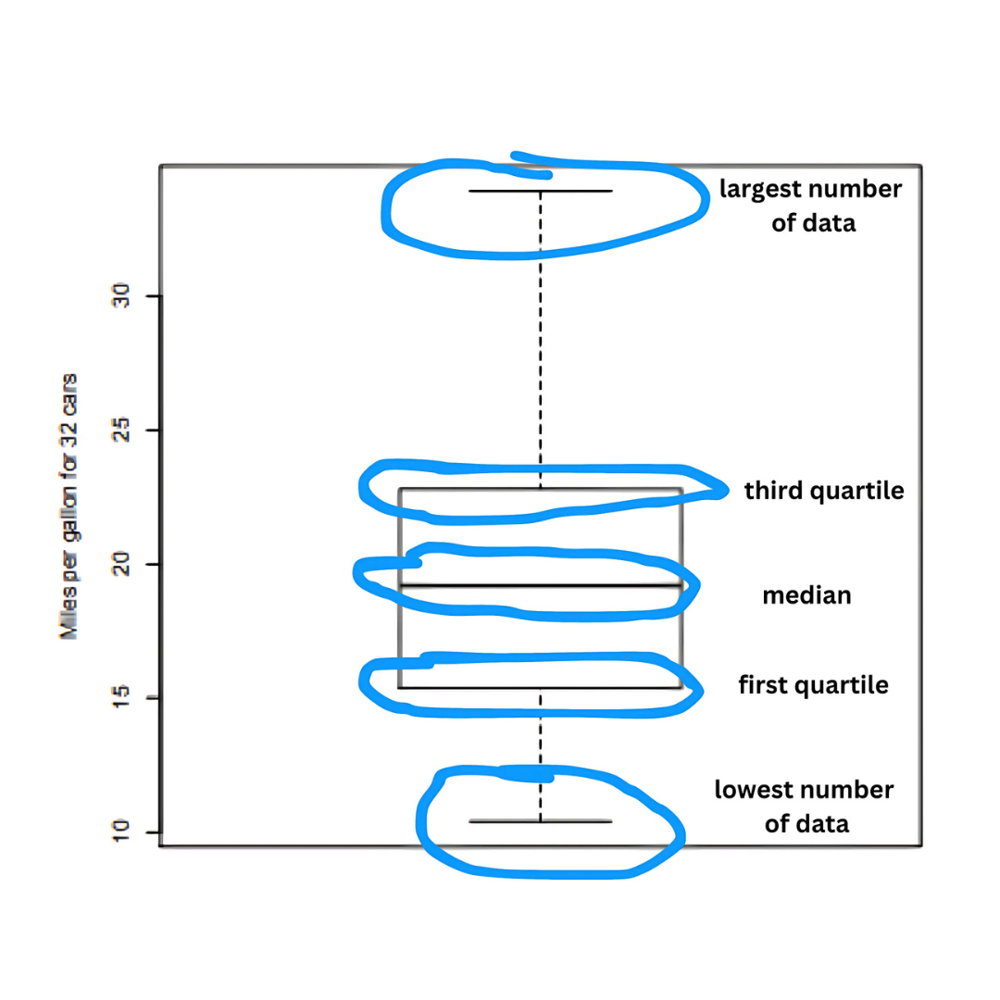
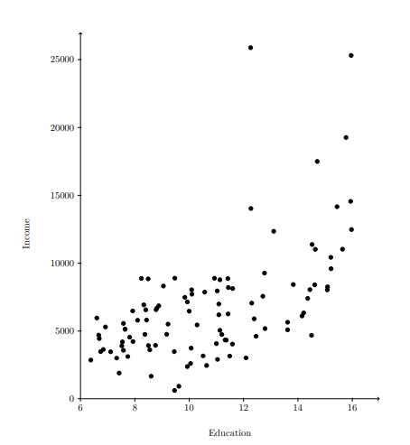
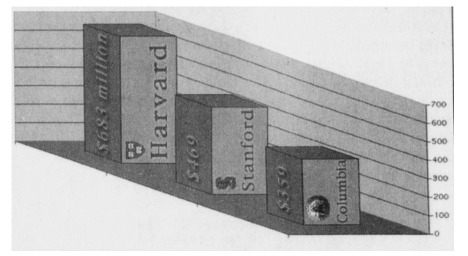

# Descriptive Statistics

Descriptive statistics refers to the branch of statistics that focuses on summarizing and describing the main features of a dataset. Rather than drawing conclusions or making predictions (which is the role of inferential statistics), descriptive statistics help us understand and interpret data by organizing it into meaningful information.

Descriptive statistics include:

1. Measures of central tendency: These describe the center or typical value of the data, such as the mean (average), median (middle value), and mode (most frequent value).

2. Measures of variability (dispersion): These describe how spread out or dispersed the data is, such as the range (difference between the highest and lowest values), variance, and standard deviation (which shows how much the data deviates from the mean).

3. Frequency distributions: These summarize how often each value occurs in the dataset, such as through tables, charts, or histograms.

In essence, descriptive statistics provide a clear and concise summary of the data, making it easier to interpret large datasets and spot trends, patterns, or outliers.

Descriptive statistics are important because they provide a way to summarize and communicate key information about a dataset in a concise manner, especially when dealing with large amounts of data. These statistics help highlight important patterns, trends, and distributions in the data, allowing for more effective reasoning and decision-making. It is best to use a graphical summary to communicate information, because people prefer to look at pictures rather than at numbers.

There are many ways to visualize the data:

## Pie Chart and Dot Plot

These 2 charts are used to visualize qualitative data such as color, car types, etc. there are advantages and disadavantages between these 2 charts:

1. it would be easier using dot plot if we want to compare frequencies of various categories
2. with pie chart, it would be very helpful to eyeball what fraction of the total a category corresponds to

## Bar Graph

we can use bar graph if the data is quantitative (i.e. numbers, then we should be put on a number line). This is because the ordering and the distance between the numbers convey important information

## Histogram Graph

this graph is similar with bar graph but, it allows you to use blocks with different widths. **The key point** of the blocks are proportional to frequency this means that the total are corresponds to 100%. Example if we want to figuring out what percentage of people fallen the age group from 60 to 80 we can see through the 60 to 80 block from the graph below.

and if we see the area for 60 to 80 group, we can say that the area is 1/7 of the total area and we can know the percentage **roughly 14%** of the people fall in to the range age 60 to 80. So we can figure out the percentage falling into a blcok without a vertical scale since the total area equals to 100%. But, sometimes it is useful for us to have the vertical scale or sometimes we called it as **density scale**. Its unit is '% per unit', so in the example above the vertical unit is '% per year'. The reason why this density sometimes useful because the area of the block corresponds to a percentage and the area is computed by width time height and since the width is given in years, the unit for the height needs to be percent per year in order for the units to work out

There are 2 kinds of inforrmation that we can get from histogram:

1. Density (crowding): The height of the bar tells how many subjects there are for one unit on the horizontal scalle. For example, the highest density is around age 19 as 0.4 = 4% of all subjects ar age 19. In contrast, only about 0.7% of subjects fall into each one year rage for ages 60-80
2. Percentages (relative frequencies): Those are given by Area = height x width. Remember that the area from this histogram corresponds to percentage and the area of the block is give by **height x width**. For example we want to know what percentage of people fall in age range between 60-80, about 14% of all subjects fall into the age range 60-80, because the corresponding area is (0.7% per year) x (20 years) = 14%. Alternatively, you can find this answer by eyeballing that this area makes up roughly 1.7 of total area of the histogram, so roughly 1/7 = 14% of all subjects fall in that range

## Box PLot

Box plot depicts 5 keys number of the data:

    - the lower whisker: shows the lowest/smallest number of data
    - the upper whisker: shows the largest/highest number of data
    - the middle: the median of the data where half od the data are smaller and half of the data are larger
    - first quartile: the number where a quarter of the data are smaller and three quarters are larger
    - third quartile: three quarters of the data are smaller and one quarter are larger

Box plot gives less information than histogram becaus it is only gives us 5 numbers of the data. But, with box plot we can visualize more than 1 dataset and put it in one graphic so it can takes up less of space and suited to compare several datasets

## The Scatter Plot

Scatter plot used to depict data come as pairs. This plot can be used to visualize the corellation between 2 variables

# Providiong Context is Key for Statistical Analyses

statistic analyses has a purpose to compare the observed data to a reference. Therefore it very useful to provide context in graphical displays. One way to provide context is by using small multiples and we have seen that **box plot** is very useful for this because it has a compact design

# Pitfalls when Visualizing Data

There is a temptation to produce graphics that is flashy, but often times that results actually in a poor outcome. For example this visualization below:

Where we can check that the visualization already good but, it can give us miss-information because we are looking at 3D blocks, when we are thinking that we are comparing of the volume of the blocks but, in fact from that visualization we actually want to compare about heights

# Mean vs Median

We used mean or median if we want to summarize the data with one number. **Median** is the number that is half data is larger and half data is smaller than the other half or we can say that as midpoint. Meand and median are the same when the histogram is symmetric. When histogram is skewed to the right, then the mean can be much larger than the median. So if the histogram is very skewed, the we used the median.

For example:

If the median sales price of 10 homes is $ 1 million, then we know that 5 homes sold for
$1 million or more. If we are told that the average sale price is $1 million, then we can’t draw such a conclusion. If the average is $1 million then th sum of 10 homes is $10 millions sales prices then we can. For the very skewed data is let assume that 1 home is $8 million then we know that the average sales for other of 9 homes is thos $2 million divided by 9 and it would be $200,000. So, if we think that the average sales price of $1 million means that most houses sold for roughly $1 million, then we are very wrong in this case.

**Conclusion**

If the histogram is very skewed then the average is not helpful and it much better to use the median

# Percentiles

A percentile is a measure used in statistics to indicate the relative standing or rank of a value within a dataset. It tells you the percentage of data points that fall below a given value. For example, if a value is at the 60th percentile, it means that 60% of the data is below that value. 

The 90th percentile is the value in a dataset below which 90% of the observations lie. It means that only 10% of the data points are higher than this value. Percentiles are useful in comparing data points to a population, as they help identify where a particular value stands in relation to the entire dataset. For example, if the 90th percentile of test scores is 85, it means that 90% of the students scored below 85, and the remaining 10% scored higher. It's often used to assess performance, cutoffs, or outliers in data.

The 90th percentile is a valuable tool for assessing performance, setting cutoffs, and identifying outliers because it represents a point in the data where most of the observations fall below, leaving only a small percentage above. Here’s how it can be applied in each context:

1. Assessing Performance
The 90th percentile is often used to evaluate high performance or exceptional outcomes. For example, if you’re analyzing test scores:

If a student’s score is in the 90th percentile, it means they performed better than 90% of the other students.
In business, if a product’s delivery time is in the 90th percentile of speed, it means that 90% of deliveries took longer, highlighting the product as one of the fastest deliveries.
This helps to benchmark performance against the majority and identify individuals or entities that are performing better than most of their peers.

2. Setting Cutoffs
The 90th percentile can be used to set thresholds or cutoffs for high performance or rare events:

In standardized testing, for instance, being above the 90th percentile might be a criterion for scholarships or honors programs.
In customer service, a company might aim to resolve 90% of issues within a certain time frame (the 90th percentile cutoff). Any case taking longer would be considered a potential issue that needs special attention.
By using the 90th percentile as a cutoff, organizations can set a target that reflects high performance while excluding the topmost extreme cases.

3. Identifying Outliers
Values above the 90th percentile are often considered outliers or exceptional cases, depending on the context. Outliers can be important to identify because they might:

Indicate unusual or extreme results that require further investigation. For example, in product quality testing, if the 90th percentile of defects is much higher than expected, it could signal a problem with the manufacturing process.
Represent rare events, such as in financial risk analysis. If the 90th percentile of investment returns is extremely high, the returns above this level may indicate risky or unusual market conditions.
By identifying data points that fall in or beyond the 90th percentile, you can spot exceptional cases that may warrant additional focus or special handling.

Summary:

Performance: The 90th percentile helps identify top performers or high achievers.
Cutoffs: It sets a threshold that separates normal from exceptional performance.
Outliers: It helps identify rare or extreme data points that may need further investigation or special attention.
In each case, the 90th percentile helps to assess where something stands relative to the larger dataset, providing insight into performance and decision-making.

# Standard Deviation

Standard deviation (SD) is a measure of how spread out or dispersed the values in a dataset are relative to the mean (average). It quantifies the amount of variation or dispersion in a set of values:

A low standard deviation means that most of the values are close to the mean.
A high standard deviation indicates that the values are spread out over a wider range.
The standard deviation gives insight into the consistency and variability of the data. It is especially useful when comparing datasets that have the same mean but different spreads.

1. Population Standard Deviation

\[
\sigma = \sqrt{\frac{1}{N} \sum_{i=1}^{N} (x_i - \mu)^2}
\]

\[
\sigma = \sqrt{\frac{1}{N} \sum_{i=1}^{N} (x_i - \mu)^2}
\]

- \(\sigma\) = population standard deviation
- \(N\) = the number of data points
- \(x_i\) = each individual data point
- \(\mu\) = the mean of the data
- \(\sum\) = summation

2. Sample Standard Deviation

\[
s = \sqrt{\frac{1}{N-1} \sum_{i=1}^{N} (x_i - \bar{x})^2}
\]

\[
s = \sqrt{\frac{1}{N-1} \sum_{i=1}^{N} (x_i - \bar{x})^2}
\]

- \(s\) = sample standard deviation
- \(\bar{x}\) = sample mean
- \(N-1\) = Bessel's correction